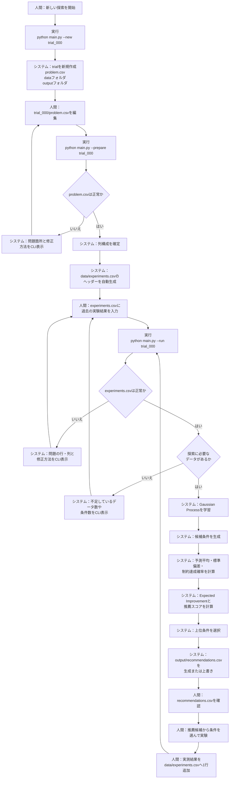

# v000：ベイズ最適化による次実験条件の探索

> 初めて利用する場合は、コマンドの実行場所とCSVへの入力手順をまとめた
> [利用手順書（USER_GUIDE.md）](USER_GUIDE.md)から読んでください。

## 1. v000の目的

v000は、蓄積された実験結果から「次に実験する価値が高い条件」を推薦する、CLI版の最小システムです。

利用者は次の3つだけを理解すれば利用できます。

```text
problem.csv
何を入力とし、何を最適化するか設定する

data/experiments.csv
実際に行った実験結果を記録する

output/recommendations.csv
次に試す候補を確認する
```

v000では、Gaussian Processと制約付きベイズ最適化を使用します。ニューラルネット、物理アンカー、グラフィカルUIは使用しません。

> **レーザー溶接モデルによる全バージョン共通検証**  
> 検証するときは、プロジェクト直下の[validation/README.md](../validation/README.md)を読んでください。使用する論理モデル、固定条件、再実行コマンド、v000の基準結果をまとめています。

このツールが出力するのは、確定した最適条件や量産条件ではありません。

> 現在の実験データを基に、次に実験する価値が高い候補を提案するものです。推薦条件は必ず実験で確認してください。

## 2. 人間とシステムの役割

### 人間が行うこと

- 新しいtrialを作る
- `problem.csv` に探索内容を書く
- `experiments.csv` に実測結果を入力する
- 推薦条件を確認する
- 実際に実験する条件を選ぶ
- 新しい実測結果を `experiments.csv` に追記する
- 推薦結果を、設備・品質・安全面から最終判断する

### システムが行うこと

- trialのフォルダとテンプレートを作る
- `problem.csv` を検査する
- `experiments.csv` のヘッダーを作る
- 実験データを検査する
- 実測済みの最良条件を確認する
- 未測定条件の結果と不確かさを予測する
- 目的と制約に基づいて候補を順位付けする
- `recommendations.csv` を生成する
- 問題がある場合は、原因と修正方法をCLIへ表示する

システムは通常の探索実行で、`problem.csv` や `experiments.csv` を変更しません。

## 3. フォルダ構成

```text
v000/
├─ src/                              共通の計算処理
│  ├─ settings.py
│  ├─ data_loader.py
│  ├─ validation.py
│  ├─ preprocessing.py
│  ├─ gp_model.py
│  ├─ acquisition.py
│  ├─ optimizer.py
│  └─ reporting.py
│
├─ trials/                           独立した探索案件
│  ├─ trial_000/
│  │  ├─ problem.csv                 探索の問題定義
│  │  ├─ data/
│  │  │  └─ experiments.csv          実測結果
│  │  └─ output/
│  │     └─ recommendations.csv      最新の推薦結果
│  │
│  └─ trial_001/
│     ├─ problem.csv
│     ├─ data/
│     │  └─ experiments.csv
│     └─ output/
│        └─ recommendations.csv
│
├─ main.py                           全操作の入口
├─ README.md
└─ requirements.txt
```

## 4. trialとは

trialは実験1回ではなく、独立した1つの探索案件を表します。

```text
trial_000
レーザー溶接条件の探索

trial_001
加熱条件の探索

trial_002
モーター制御条件の探索
```

同じ探索の中で実験を繰り返す場合は、新しいtrialを作りません。同じ `experiments.csv` に実測結果を追加して使い続けます。

### 同じtrialを継続する例

- 推薦条件を実験した
- 実験結果が1件増えた
- 同じ工程・同じ評価項目で探索を続ける
- 探索範囲を少し狭くした
- 制約値を調整した

### 新しいtrialに分ける例

- 対象工程が異なる
- 入力パラメータの意味が異なる
- 検査結果の意味が異なる
- 最適化目的が異なる
- 材料や装置が変わり、データを混ぜるべきでない

## 5. main.pyの操作

すべての操作は `main.py` から行います。

### 新しいtrialを作る

```powershell
python main.py --new trial_000
```

### problem.csvを確認し、experiments.csvを準備する

```powershell
python main.py --prepare trial_000
```

### 実験データを使って探索する

```powershell
python main.py --run trial_000
```

省略時は3件の候補を出力します。次の実験で必要な推薦数を指定する場合は、
`--n`を追加します。

```powershell
python main.py --run trial_000 --n 9
```

1位は制約付き改善スコアが最も高い条件です。2位以降は、実測点と先に選んだ
推薦点からの距離も考慮し、有望度を保ちながら探索空間を広くカバーします。
`--n`は今回欲しい推薦数であり、直前にCSVへ追加した実験行数とは連動しません。

## 6. 全体フロー



## 7. Step 1：新しいtrialを作る

人間が次を実行します。

```powershell
python main.py --new trial_000
```

システムは次を生成します。

```text
trials/
└─ trial_000/
   ├─ problem.csv
   ├─ data/
   └─ output/
```

この時点では次の状態です。

- `problem.csv`：記入用テンプレート
- `data/`：空
- `output/`：空
- `experiments.csv`：まだ存在しない
- `recommendations.csv`：まだ存在しない

同名trialが既にある場合は上書きしません。

```text
[エラー]
trial_000は既に存在します。

既存ファイルは変更していません。
別のtrial名を指定してください。
```

## 8. Step 2：problem.csvを編集する

`problem.csv` は、そのtrialで「何を入力し、何を良くしたいか」を定義するファイルです。

例：

```csv
column,display_name,unit,role,direction,lower,upper,step,target
p1,コアパワー,W,parameter,,350,500,10,
p2,リングパワー,W,parameter,,1750,2395,5,
t,照射時間,ms,parameter,,34,70,1,
T,トルク強度,N,constraint,greater_equal,,,,70
S,セパレータ熱影響,mm,objective,minimize,,,,
```

### problem.csvの列

| 列 | 内容 |
|---|---|
| `column` | `experiments.csv` で使用する列名 |
| `display_name` | CLIに表示する分かりやすい名称 |
| `unit` | 単位。不明な場合は空欄可 |
| `role` | `parameter`、`objective`、`constraint`、`monitor` |
| `direction` | `minimize`、`maximize`、`greater_equal`、`less_equal` |
| `lower` | パラメータ探索下限 |
| `upper` | パラメータ探索上限 |
| `step` | 候補を生成する間隔 |
| `target` | 制約の基準値 |

### roleの意味

| role | 意味 |
|---|---|
| `parameter` | 実験時に設定する入力条件 |
| `objective` | 最小化または最大化する検査結果 |
| `constraint` | 基準以上または基準以下にする検査結果 |
| `monitor` | 最適化には使わず、予測だけ行う検査結果 |

v000では、目的変数は1個に限定します。制約変数と参考出力は複数指定できます。

## 9. Step 3：experiments.csvを準備する

`problem.csv` を編集した後、次を実行します。

```powershell
python main.py --prepare trial_000
```

システムは `problem.csv` を検査します。

### problem.csvに問題がある場合

```text
[エラー]
problem.csvの設定に問題があります。

p1のlowerがupper以上です。
lower: 500
upper: 350

problem.csvを修正して、もう一度--prepareを実行してください。
```

この場合、`experiments.csv` は生成しません。

### problem.csvが正常な場合

システムが次を生成します。

```text
trials/trial_000/data/experiments.csv
```

上記のproblem.csvに対しては、次のヘッダーになります。

```csv
experiment_id,p1,p2,t,T,S
```

列順は次に統一します。

```text
experiment_id
→ parameter
→ objective、constraint、monitor
```

既に `experiments.csv` が存在する場合、`--prepare` は上書きしません。`problem.csv` と既存ヘッダーが一致しない場合は、差分をCLIへ表示して処理を止めます。

## 10. Step 4：過去の実験結果を入力する

人間が `experiments.csv` をExcelなどで開き、実測結果を入力します。

```csv
experiment_id,p1,p2,t,T,S
0,350,1750,70,104.1,2.32
1,465,2335,40,77.0,2.256
2,465,2335,40,78.7,1.749
3,500,2375,35,44.2,1.432
```

### experiments.csvのルール

- 1行を1回の実験とする
- 実測値だけを入力する
- 予測値を入力しない
- 欠損値を作らない
- 数値セルに単位やコメントを書かない
- 桁区切りカンマを使用しない
- 小数点には `.` を使用する
- 同じ条件の反復測定は複数行で記録できる
- `experiment_id` はtrial内で重複させない

CSVは、UTF-8、UTF-8 BOM付き、およびWindows版Excelで作成されるCP932系文字コードへの対応を想定します。区切り文字はカンマに限定します。

人間側で、不要な見出し、合計行、メモ行、明らかな入力ミスを除いてから使用します。システムは異常値を勝手に削除・補完しません。

## 11. Step 5：最初の探索を実行する

実験結果を入力した後、次を実行します。

```powershell
python main.py --run trial_000
```

システムは次を確認します。

- `problem.csv` が存在し、内容が正常か
- `experiments.csv` が存在するか
- 必要な列があるか
- 値を数値へ変換できるか
- 欠損値がないか
- `experiment_id` が重複していないか
- 同一条件の反復が何件あるか
- 探索に必要な固有条件数があるか
- 探索候補数が上限を超えていないか

問題がある場合は、問題の行・列と修正方法をCLIへ表示します。

```text
[エラー]
experiments.csvの5行目に問題があります。

列「T」が空欄です。

Tの実測値を入力するか、5行目を削除してください。
```

## 12. 探索処理

入力検査に成功すると、次の順で処理します。

```text
同一条件の反復測定を集計
    ↓
入力パラメータを同じ尺度へ正規化
    ↓
各検査結果にGaussian Processを学習
    ↓
problem.csvの上下限と刻みから候補を生成
    ↓
測定済み条件を推薦候補から除外
    ↓
各候補の予測平均と予測標準偏差を計算
    ↓
各制約の達成確率を計算
    ↓
目的変数のExpected Improvementを計算
    ↓
推薦スコアを計算
    ↓
1位は推薦スコア最大、2位以降は空間分散も考慮して選択
```

### Gaussian Process

`objective`、`constraint`、`monitor` の各出力に、別々のGaussian Processを使用します。

各候補について次を計算します。

- 予測平均
- 予測標準偏差
- 制約を満たす確率
- 現在の実測最良値を改善する期待値

### 複数制約

制約が複数ある場合、v000では各制約の達成確率を掛け合わせて総合制約達成確率とします。

```text
総合制約達成確率
= 制約1の達成確率
× 制約2の達成確率
× ...
```

これは各出力を独立として扱う簡易計算です。出力間の相関を厳密に扱う多出力モデルはv000の対象外です。

### 推薦スコア

基本形は次のとおりです。

```text
推薦スコア
= 総合制約達成確率
× 目的変数のExpected Improvement
```

### 複数候補の分散

`--n`で複数件を指定した場合、1位は推薦スコアが最大の条件をそのまま選びます。
2位以降は、推薦スコアに加えて次の点からの正規化距離を評価します。

- 既存のすべての実測条件
- その回ですでに選んだ推薦条件

分散比率は利用者が設定せず、毎回モデル状態から15～50%の範囲で自動決定します。
推薦スコア上位5%について、目的変数の予測不確かさと実測点からの未被覆距離を
確認し、不確かで遠い場合は広く、十分観測されている場合は狭く推薦します。
推薦スコアと空間分散を自動比率で幾何合成します。この処理は2位以降だけに適用
されるため、1位の条件は従来の単一推薦と同じです。

自動比率、判断に使用した不確かさ、未被覆距離は`recommendations.csv`へ保存します。
単純に実験回数とともに狭めるのではなく、新しい有望領域が実測点から遠い場合は
途中でも分散を再び強めます。

制約を満たす実測条件があり、1位候補自身の総合制約達成確率が1%未満まで低下した
場合は、探索スコアが退化したと判断します。この場合だけ2位以降で達成確率1%以上の
候補を優先し、全推薦が極端な制約違反領域へ集中することを防ぎます。1位にはガードを
適用せず、元の推薦スコア最大条件を維持します。指定件数を満たす候補がない場合は
自動的に緩和します。

まだ制約を満たす実測点がない場合は、制約を満たす可能性と、未知領域の情報を増やす価値を組み合わせます。

## 13. 入力数・出力数

列名や列数はコードへ固定しません。`problem.csv` から動的に判断します。

### 入力パラメータ

- 任意個数へ対応する設計
- v000での推奨は1～5個
- 数値パラメータのみ
- カテゴリ入力は非対応

### 出力

- `objective`：必ず1個
- `constraint`：0個以上
- `monitor`：0個以上
- 複数目的最適化は非対応

入力数が増えると候補数が急増します。

```text
2パラメータ × 各10候補 = 100候補
3パラメータ × 各10候補 = 1,000候補
4パラメータ × 各10候補 = 10,000候補
5パラメータ × 各10候補 = 100,000候補
6パラメータ × 各10候補 = 1,000,000候補
```

v000では総候補数を最大200,000件に制限します。超える場合は探索範囲を狭くするか、刻みを大きくするようCLIで案内します。

## 14. Step 6：recommendations.csvを確認する

探索が正常に終了した場合だけ、次を生成または上書きします。

```text
trials/trial_000/output/recommendations.csv
```

入力と出力の列数に応じて、CSVの列は動的に変わります。

現在の3入力・2出力の場合の例：

```csv
generated_at,data_rows,rank,p1,p2,t,T_mean,T_std,T_probability,S_mean,S_std,expected_improvement,recommendation_reason
2026-07-31T10:00:00,24,1,500,1755,57,80.6,24.7,0.666,0.99,0.52,0.585,制約達成確率と改善期待値が高い
2026-07-31T10:00:00,24,2,490,1765,57,80.6,24.7,0.666,0.99,0.52,0.584,未知領域を確認できる
```

`generated_at` と `data_rows` により、履歴ファイルを作らなくても、いつ・何件のデータで計算した結果かを確認できます。

CLIには主要情報だけを表示します。

```text
ParamOptimizer v000

trial: trial_000
実験データ: 24件
固有条件: 10件
入力パラメータ: p1, p2, t
目的: Sを最小化
制約: T >= 70
探索候補: 76,960件

推薦結果:
1位 p1=500, p2=1755, t=57
2位 p1=490, p2=1765, t=57
3位 p1=470, p2=1750, t=58

注意:
推薦値はモデル予測です。実測による確認が必要です。

出力:
trials\trial_000\output\recommendations.csv
```

## 15. Step 7：推薦条件を実験し、結果を追加する

人間は `recommendations.csv` を確認し、設備・材料・安全面も考慮して実験条件を選びます。必ず1位を実行する必要はありません。

実験後、`experiments.csv` の末尾へ実測結果を1行追加します。

追加前：

```csv
experiment_id,p1,p2,t,T,S
0,350,1750,70,104.1,2.32
1,465,2335,40,77.0,2.256
```

追加後：

```csv
experiment_id,p1,p2,t,T,S
0,350,1750,70,104.1,2.32
1,465,2335,40,77.0,2.256
2,500,1755,57,74.5,1.28
```

再び実行します。

```powershell
python main.py --run trial_000
```

システムは追加されたデータを含めて再学習し、`recommendations.csv` を最新結果へ上書きします。

以降は次を繰り返します。

```text
recommendations.csvを見る
    ↓
実験条件を選ぶ
    ↓
実験する
    ↓
experiments.csvへ1行追加する
    ↓
python main.py --run trial_000
    ↓
recommendations.csvが更新される
```

## 16. ファイル生成のタイミング

| ファイル・フォルダ | 生成タイミング | 生成者 | その後の扱い |
|---|---|---|---|
| `trial_000/` | `--new` 実行時 | システム | 人間は通常、名前を変更しない |
| `problem.csv` | `--new` 実行時 | システム | 人間が編集する |
| `data/` | `--new` 実行時 | システム | システム管理 |
| `output/` | `--new` 実行時 | システム | システム管理 |
| `experiments.csv` | `--prepare` 成功時 | システム | 人間が実測結果を追記する |
| `recommendations.csv` | `--run` 成功時 | システム | 探索成功ごとに上書きする |

## 17. エラー時の扱い

### `--new` が失敗した場合

- 既存trialを上書きしない
- 中途半端なtrialを残さない
- 原因をCLIへ表示する

### `--prepare` が失敗した場合

- `problem.csv` を変更しない
- `experiments.csv` を生成・上書きしない
- 設定の問題箇所を表示する

### `--run` が失敗した場合

- `problem.csv` を変更しない
- `experiments.csv` を変更しない
- `recommendations.csv` を更新しない
- 既存の `recommendations.csv` がある場合は、以前の結果であることをCLIへ表示する

```text
[エラー]
探索に失敗しました。

recommendations.csvは更新されていません。
既存ファイルは以前のデータに基づく結果です。
```

正常終了した場合だけ、一時ファイルから `recommendations.csv` へ安全に置き換えます。

## 18. v000で生成しないもの

利用者の混乱を避けるため、v000のtrial出力は `recommendations.csv` だけにします。

次は生成しません。

- 推薦履歴CSV
- 全候補一覧CSV
- 検証結果CSV
- 実行メタデータJSON
- ログファイル
- 予測と実測の比較履歴
- グラフ
- HTML

必要性が運用上確認できたものだけを、後から追加します。

## 19. v000で実装しない機能

- ニューラルネット
- 物理アンカー
- Web UI
- 複数目的最適化
- カテゴリパラメータ
- 出力間の相関を扱う多出力GP
- 入力データの自動補完
- 異常値の自動削除
- 実験結果の自動追記

## 20. 完成条件

- `--new` で既存データを壊さずtrialを作成できる
- `--prepare` でproblem定義からCSVヘッダーを生成できる
- `--run` で入力検査から推薦CSV生成まで完了できる
- 入力パラメータ名と個数をコードへ固定しない
- 目的1個、制約複数、参考出力複数に対応できる
- 同一条件の反復測定を扱える
- 実測済み条件を推薦候補から除外できる
- 候補数が200,000件を超える場合に停止できる
- 問題のある行・列と修正方法を日本語で表示できる
- 失敗時に入力ファイルと既存推薦結果を壊さない
- 成功時だけ `recommendations.csv` を安全に更新できる
- 同じデータと設定から同じ推薦結果を再生成できる
- READMEだけで、分析初心者が人間側の操作を理解できる

## 21. 現在の状態

v000の初期実装は完了しています。

- `--new` によるtrial作成
- `--prepare` によるproblem検査と実験CSV準備
- `--run` による入力検査、Gaussian Process、候補探索
- 制約達成確率とExpected Improvementによる推薦
- 最新の `recommendations.csv` 出力
- 入力エラーの日本語表示
- 失敗時の入力・既存出力保護

最初に次を実行してtrialを作成してください。

```powershell
python main.py --new trial_000
```
